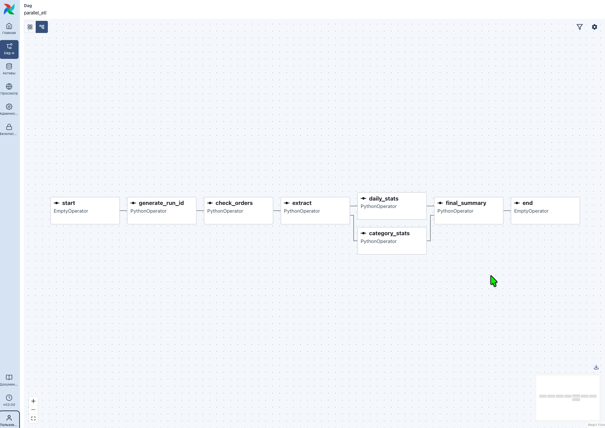
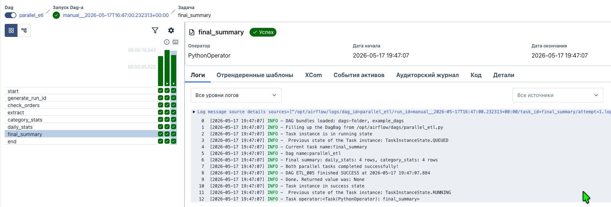
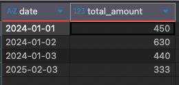
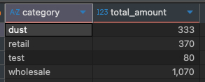
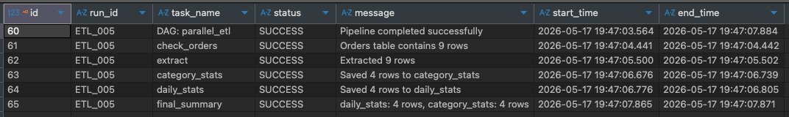

# ETL Pipeline на Apache Airflow

[](https://airflow.apache.org/)
[](https://www.python.org/)

# Описание проекта
ETL-пайплайн для агрегации данных из SQLite. Демонстрирует:
- Оркестрацию ETL-процессов в Apache Airflow 3.2.1
- Параллельное выполнение задач (branching)
- Логирование выполнения с временными метками (Московское время)
- Использование XCom для передачи данных между задачами
- Два типа подключения к БД: чтение из 'source.db' через прямой путь (sqlite3.connect), запись в 'result.db' через Connection Airflow (SqliteHook)
- Работу с Connections через Admin UI

# Технологический стек
- Apache Airflow 3.2.1 — оркестрация
- SQLite — хранилище данных
- Python 3.13 — pandas, sqlite3
- Docker — контейнеризация

# Архитектура пайплайна
source.db (таблица orders)
↓ (extract, прямой путь: sqlite3.connect)
DataFrame в памяти (XCom)
↓
├── daily_stats (агрегация по дням)
└── category_stats (агрегация по категориям)
↓
result.db (таблицы daily_stats, category_stats, etl_log) через Connection result_db
↓
final_summary (логирование результата)

# Быстрый старт

# 1. Клонировать репозиторий
```bash
git clone https://github.com/A1exSK/airflow-etl-project.git
cd airflow-etl-project

# 2. Запустить Airflow
docker-compose up -d --build

# 3. Инициализировать базы данных
docker-compose exec airflow-scheduler python /opt/airflow/init_db.py

# 4. Открыть веб-интерфейс
http://localhost:8080
Логин: airflow
Пароль: airflow

# 5. Запустить DAG parallel_etl
Результаты работы
daily_stats — сумма заказов по дням
category_stats — сумма заказов по категориям
etl_log — журнал выполнения (run_id, статус, время начала/окончания)

# Мониторинг
Статус задач в Airflow UI (Graph → Logs)
SQL-запросы к таблицам result.db

# Автор
Aleksandr Korostenskii - linkedin.com/in/aleksandr-korostenskii-9432252a0

# Лицензия
MIT License — подробнее в файле [LICENSE]

## Screenshots

### DAG Graph


### Task Log Example


### Results

#### daily_stats table


#### category_stats table


#### etl_log table
